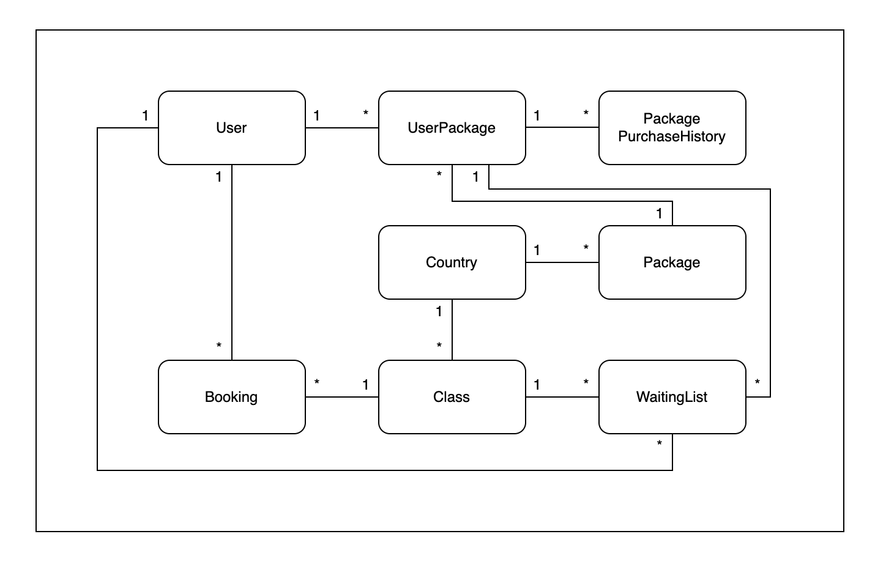
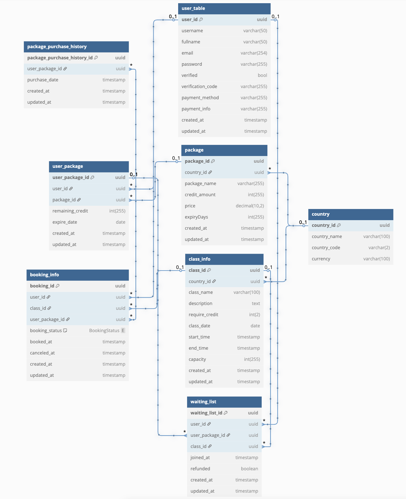

# booking-system

## Table of Contents

- [Docker](#Docker)
- [Database](#Database)

---

## Docker

`docker-compose -p codetest up`
- This will run the project along with mysql, redis and quartz using mysql

---

## Database

- This is the class diagram used in this project.

- This is the detailed class diagram used in this project.

